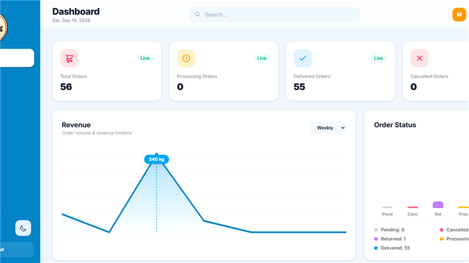
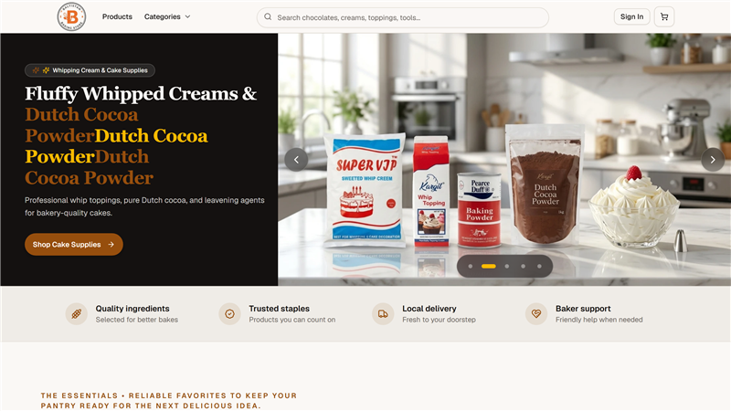
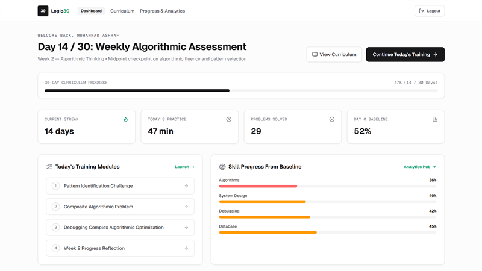
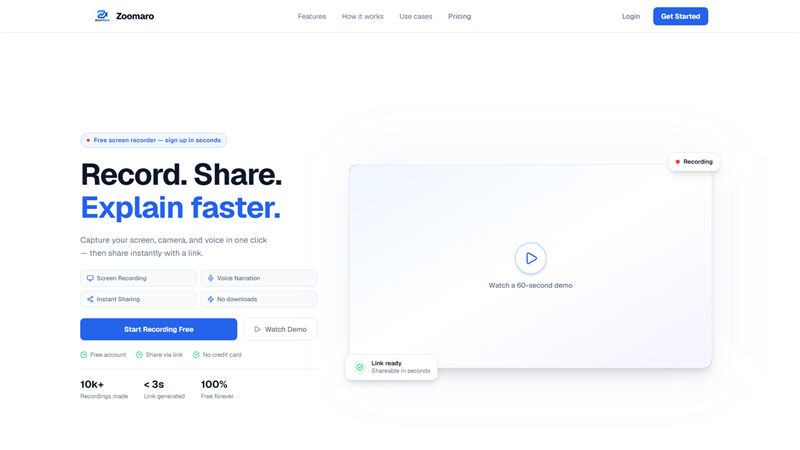
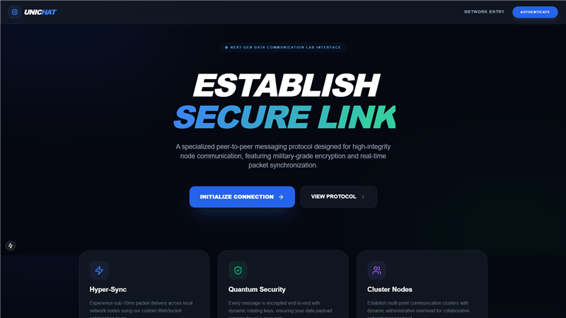

# 👋 Hi, I'm Muhammad Ashraf

### Full Stack Developer | JavaScript Enthusiast | Problem Solver

---

## 🚀 About Me

> Passionate Full Stack Developer from Pakistan, crafting scalable web applications with modern technologies.

- 🔭 Currently building: Real-time Pakistani Sign Language (PSL) recognition app — Expo/React Native frontend, FastAPI + TFLite/BiLSTM backend, server-side MediaPipe landmark extraction
- 🌱 Learning: ML model deployment and optimization for real-time inference
- 💡 Expertise: TypeScript, React, Next.js, Node.js, React Native, Socket.io, WebRTC
- 🎯 Focus: Building scalable, production-ready full-stack products
- 📫 Reach me: **muhammadashraf2921323@gmail.com**

---

## 🛠️ Tech Stack

### Frontend

### Backend

### Tools & Others

---

## 📊 GitHub Analytics

<table>
  <tr>
    <td width="48%">
      
    </td>
    <td width="4%"></td>
    <td width="48%">
      
    </td>
  </tr>
</table>

---

## 🏆 GitHub Trophies

---

## 📈 Contribution Graph

  

---

## 💻 LeetCode Stats

  

---

## 🎯 Featured Projects

<table>
  <tr>
    <td width="50%" align="center">
      <h3>🏭 Business Operations Dashboard</h3>
      
      
A private factory operations dashboard for recording Orders, Expenses, tracking inventory, managing customer order history, and generating financial reports.

      
<strong>Next.js • Firebase • TypeScript • TailwindCSS</strong>

    </td>
    <td width="50%" align="center">
      <h3><a href="https://baltistanbakingstore.com/">🛒 Baltistan Baking Store</a></h3>
      
      
A high-performance modern e-commerce platform for baking supplies and artisanal ingredients, deployed serverless on Cloudflare Workers.

      
<strong>Next.js 15 • TypeScript • Cloudflare Workers • Drizzle ORM • TailwindCSS</strong>

    </td>
  </tr>
  <tr>
    <td width="50%" align="center">
      <h3>🧠 Logic30 – Algorithmic Training Platform</h3>
      
      
A structured 30-day algorithmic problem-solving platform featuring in-browser Monaco code execution, real-time skill radars, and interactive learning roadmaps.

      
<strong>Next.js 16 • TypeScript • TailwindCSS • Monaco Editor • Prisma • Recharts</strong>

    </td>
    <td width="50%" align="center">
      <h3>🎥 Zoomaro</h3>
      
      
A cutting-edge video sharing and communication platform similar to Loom. Enables users to record, share, and collaborate on videos with seamless cloud integration.

      
<strong>Next.js • Node.js • WebRTC • Cloudinary</strong>

    </td>
  </tr>
  <tr>
    <td width="50%" align="center">
      <h3>💬 Uni-Chat</h3>
      
      
A comprehensive real-time communication suite featuring encrypted chatting, HD video calls, and distributed cloud storage.

      
<strong>React • Node.js • Socket.io • PeerJS • MongoDB</strong>

    </td>
    <td width="50%" align="center">
      <h3><a href="https://github.com/MuhammadAshraf23/attendence-app">📋 Attendance Management System</a></h3>
      
      
A professional full-stack attendance tracking solution designed for scalability. Implements sophisticated authentication and real-time data visualization.

      
<strong>MongoDB • Express.js • React • Node.js</strong>

    </td>
  </tr>
</table>

---

## 🤝 Connect With Me

📄 **[View My Resume](https://drive.google.com/file/d/1wipbvjsy0BPJHCnhiVtNbTJz3XOV6F_y/view?usp=drive_link)**

---

  
### 💡 *"Code is like humor. When you have to explain it, it's bad."* - Cory House

**Thanks for visiting! Let's connect and build something amazing together! 🚀**

⭐️ From [muhammadashraf23](https://github.com/muhammadashraf23)

